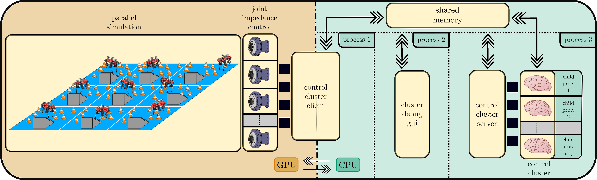
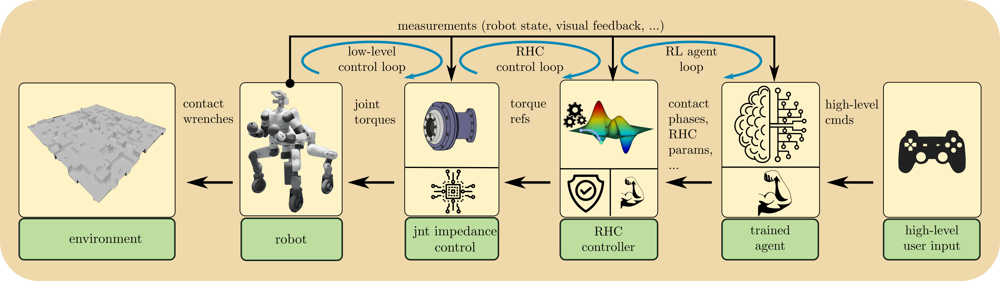

# ControlClusterUtils
If you have a beautiful CPU-based controller (developed, for example, with Trajectory Optimization tools like [horizon-casadi](https://github.com/ADVRHumanoids/horizon)) and want to implement a *Learning-Based Receding Horizon Control* approach without having to rewrite your whole controller on GPU, then this might be the right tool for you. 
Ideally, one would want both the simulator and the controllers to live on GPU, but high-level tools for Trajectory Optimization are not available (yet).

ControlClusterUtils is a tool for bridging parallel simulations (typically GPU-based), with a cluster of CPU-based (receding-horizon) controllers. 

 

The package is tailored to *Learning-Based Receding Horizon Control* approaches, in which classical Optimal Control and Trajectory Optimization meet Machine Learning. 

For instance, a possible usage for this package is in frameworks similar to the following one:

 

where a R.L. agent is coupled with a MPC controller. This allows to maintain performance, while guaranteeing constraints satisfaction and, hence, safety. 

This tool can be easily embedded into gyms (e.g [Gymnasium](https://gymnasium.farama.org/)) to perform the training phase of a R.L. agent. For minimal usage examples of this package with [Omniverse Isaac Sim](https://docs.omniverse.nvidia.com/app_isaacsim/app_isaacsim.html), have a look [here](https://github.com/AndrePatri/LRhcExamples).

As can be seen from the top picture, the package is made, at its core, of the following components:
- A `ControlClusterSrvr` object is in charge of loading and spawning a number of controllers over separate child processes. Each controller must inherit from a base `RHController` class. Controllers are added to the server via the `add_controller` method.
- A `ControlClusterClient` object represents the interface between the controllers and the parallel simulation environment (e.g. Omniverse Isaac Sim). 
- Data is shared and passed between *cluster server*, *cluster client* and the *control cluster* employing shared memory, for minimum latency (no need for serialization/deserialization and/or messages exchange) and maximum flexibility. 
The low-level implementation of the shared data mechanism is hosted in `utilities/shared_mem.py`. Specifically, the package uses [posix_ipc](https://github.com/osvenskan/posix_ipc) and [mmap](https://docs.python.org/3.7/library/mmap.html) to build shared memory clients and servers which create and manage views of specific memory regions. 

- When `ControlClusterClient`'s `solve` is called, the shared cluster state is synched with the one from the simulator (this might require a copy from GPU to CPU), all the controllers in the cluster run the solution of their associated control problem and fill a shared solution object with updated data. By design, the client's `solve` will block until all controllers have returned. This way, the cluster is always synchronized with the simulator.

- Additionally, a debugging Qt5-based gui is also provided:

    
 

    At its current state, the GUI has the following main features:
    - selection of which shared data to monitor (all or a subset of them).
    - arbitrary plot resizing and window collapsing
    - online window length resizing
    - online sample and update rate selection
    - for each window, line selection/deselection
    - pause/unpause of all or individual plots for better debugging
    - control cluster triggering
    - day/night mode

Some notes: 
- The package is also available through Anaconda at [control_cluster_utils](https://anaconda.org/AndrePatri/control_cluster_utils) (as of now, for Python 3.7 only since Isaac Sim 2022.2.1 only supports that). `ControlClusterUtils` is under active development, so its Anaconda version might not be always updated with the tip of this repo. For cutting-edge features, always refer to the source code hosted here.
- The reasons for using the third party library `posix_ipc` instead of the newest [multiprocessing.shared_memory](https://docs.python.org/3/library/multiprocessing.shared_memory.html) are twofold. First, `posix_ipc` is more flexible since it allows potentially communication with non-python applications. Second, and more importantly, `multiprocessing.shared_memory` is available only from Python 3.8 onwards and this might cause issues if interfacing with a simulator supporting earlier versions of Python (like IsaacSim 2022.2.1, which is only compatible with Python 3.7). Choosing `posix_ipc` thus enables maximum compatibility.

#### ToDo:

- [] RhcTaskRef setting throrugh keyboard commands for controller debugging.  
- [] add basename to shared memory to avoid conflicts with other running instances of the clients and server
