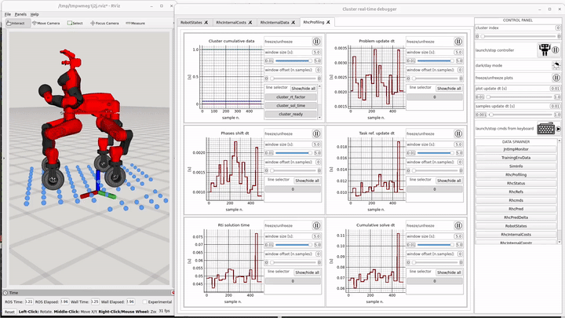

<h2 align="center" style="text-decoration: none;"> 

</h2>

Parallel MPC cluster manager, based on a client-server architecture, for use with high-throughput vectorized simulation and more. Designed for data-hungry applications, like RL-Augmented MPC (see [AugMPC](https://github.com/AndrePatri/AugMPC)).

Ships with many useful tools for MPC development, including an extensible GUI for real-time debug.

  

(robot visualization on the left comes from <a href="https://github.com/AndrePatri/MPCViz">MPCViz</a>)

## Why MPCHive
- **Throughput**: from hundreds up to thousands of parallel MPC controllers (on CPU) for RL data collection, batch benchmarking, MPC design and more.
- **Determinism**: careful shared-memory implementation and MPC synchronization ensure reliable data (see [EigenIPC](https://github.com/AndrePatri/EigenIPC)).
- **Modularity**: Clean separation between `ControlClusterServer`, `ControlClusterClient` (process manager), and controller implementations.
- **Flexibility**: drop in your own MPC formulations by subclassing `RHController` and `ControlClusterClient`; mix different clusters for different robots or formulations.
- **Real/Sim parity**: same shared-memory schema for simulation, hardware-in-the-loop, and real deployments.

## Architecture
- **ControlClusterServer** (`mpc_hive.cluster_server.control_cluster_server`). It's the interface with the simulator/real robot and creates shared-memory data servers for `RobotState`, `RhcCmds`, `RhcPred`, `RhcPredDelta`, `RhcRefs`, `RhcStatus`, and so on. The whole cluster runs at a fixed `cluster_dt`, static across all MPCs. Multiple clusters can be used to circumvent this limitation.
- **ControlClusterClient** (`mpc_hive.cluster_client.control_cluster_client`): spawns a pool of processes (one for each MPC) and manages their lifetime. MPCs register to the cluster and have assigned a unique id, which is then used to properly access data when reading robot states and writing solutions. The `ControlClusterClient._generate_controller()` method should be overriden to return a copy of your specific controller.
- **Controllers**: All MPC implementation should inherit from the `mpc_hive.controllers.rhc.RHController` base class. When triggered remotely by `ControlClusterServer.trigger_solution()`, controllers read the state of the robot, run the solver algorithm, write the solution, and update profiling/debug data, all using their unique registration index within the cluster.
- **Shared data utilities** (`mpc_hive.utilities.shared_data.*`): [EigenIPC](https://github.com/AndrePatri/EigenIPC)-backed tensors/dicts abstractions for all robot/cluster data; GPU mirrors based on Torch are optionally made available for interfacing with GPU simulators.
- **Utilities**: debugger GUI, keyboard/joy teleop, etc..

## Installation

The preferred way to install MPCHive is through [IBRIDO](https://github.com/AndrePatri/IBRIDO)'s container, which ships with all necessary dependencies. To setup the container, follow the instructions at [ibrido-containers](https://github.com/AndrePatri/ibrido-containers).

## Quick start

The easiest way to get started is to run one of the examples provided by the [AugMPC](https://github.com/AndrePatri/AugMPC) project, following the instructions available at [ibrido-containers](https://github.com/AndrePatri/ibrido-containers), which already demonstrate the integration with vectorized simulators and implementations of specific MPC controllers.
